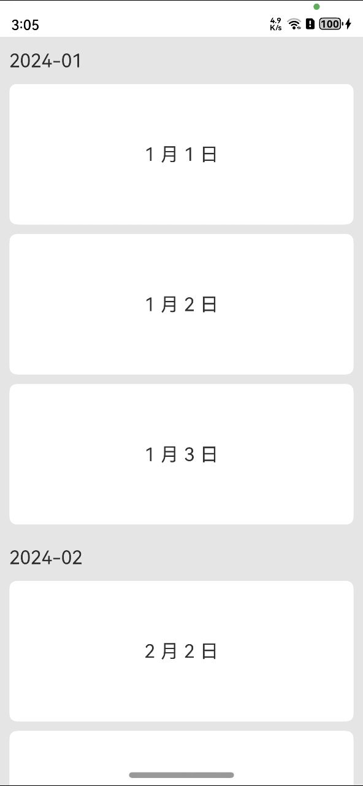
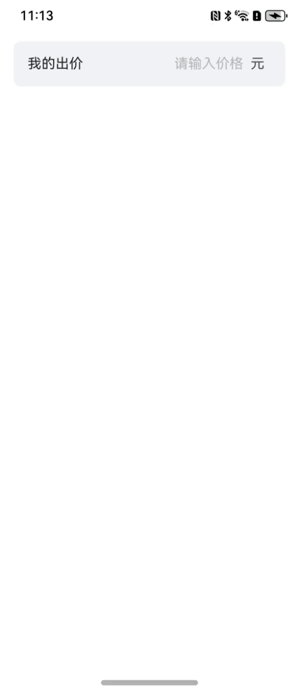

# 鸿蒙开源组件仓库

## 项目简介

本项目是一个鸿蒙的开源组件库，旨在为鸿蒙开发者提供一个方便、高效、稳定的组件集合，帮助开发者快速构建应用。我们的目标是通过共享和协作，让更多的鸿蒙开发者受益。

## 项目定位

我们的开源组件库主要面向以下场景：

1. 快速搭建原型：提供一系列常用的组件，帮助开发者快速搭建原型，验证想法。
2. 提高开发效率：通过封装通用功能，减少重复代码，提高开发效率。
3. 学习交流：分享优秀的组件实现，促进技术交流与学习。

## 项目作用

我们的开源组件库具有以下作用：

1. 节省时间：提供现成的组件，避免重复造轮子，节省开发时间。
2. 降低门槛：对于初学者，可以通过学习和使用这些组件，快速掌握相关技能。
3. 提高质量：通过共享和协作，不断优化和完善组件，提高整体质量。
4. 促进创新：鼓励开发者尝试新的技术和方法，推动技术创新和发展。

## 组件预览

目前开放的组件有四个：(更多组件陆续开放中)
1.列表刷新加载组件

2.数字键盘

3.地址组件

4.图片轮播组件


## 下载安装
```
ohpm install @ohos/pulltorefreshForHead
```
## 使用说明
```ets
@State data: GroupData[] = [];
@State headTitle: GroupData = new GroupData()
@State showFakeHead: boolean = true
// 需绑定列表或宫格组件
private scroller: Scroller = new Scroller();
@State private dataModel: PullRefreshModel = new PullRefreshModel()
private itemDataGroupNew: GroupData[] = [....]// 假数据省略

@Builder
private getListView() {
    // 列表首条 Item，下拉刷新组件
    RefreshLayout({
      refreshLayoutClass: new CustomRefreshLoadLayoutClass(this.dataModel.isVisiblePullDown, this.dataModel.pullDownRefreshImage,
    this.dataModel.pullDownRefreshText, this.dataModel.pullDownRefreshHeight)
    })

   // 1. 假的占位 head 头
  Row() {
    this.itemHead()
  }
  .visibility(this.showFakeHead? Visibility.Visible : Visibility.None)

  List({space:20, scroller: this.scroller }) {
    ListItem() {
      Row() {
          // 2. 列表的head头
        this.itemHead()
      }.visibility(!this.showFakeHead? Visibility.Visible : Visibility.None)
    }

    ForEach(this.data, (item: GroupData) => {
      ListItem() {
        Column() {
          Row() {
            // 3. 列表中不悬浮的 head
            Text(item.head)
              .fontSize(20)
              .height(50)
              .backgroundColor('#FF667075')
              .width('100%')
          }.visibility(item.isHead ? Visibility.Visible : Visibility.None)

          Text(item.content)
            .width('100%')
            .height(150)
            .fontSize(20)
            .textAlign(TextAlign.Center)
            .backgroundColor('#FF6600')
            .visibility(!item.isHead ? Visibility.Visible : Visibility.None)
        }
      }
    })
    // 列表末条 Item，上拉加载更多
    ListItem() {
      if (this.dataModel.hasMore) {
        LoadMoreLayout({
          loadMoreLayoutClass: new CustomRefreshLoadLayoutClass(this.dataModel.isVisiblePullUpLoad, this.dataModel.pullUpLoadImage,
            this.dataModel.pullUpLoadText, this.dataModel.pullUpLoadHeight)
        })
      } else {
        NoMoreLayout()
      }
    }
  }
  .onTouch((event: TouchEvent | undefined) => {
    if (event) {
      if (this.dataModel.pageState === PageState.Success) {
        // 分发触摸事件
        listTouchEvent(this.dataModel, event, (isLoadMore: boolean) => {
          this.getData(isLoadMore)
        });
      }
    }
  })
  .onScrollIndex((start: number, end: number) => {
    console.log(`headfloat start:${start}`)
    if (this.data.length > start) {
      let startValue = this.data[start]
      // 4. 赋值 head 数据
      this.headTitle = startValue
    }
    let yOffset: number = this.scroller.currentOffset().yOffset
    if (yOffset >= -0.01) {
        // 5. 控制 head 头展示
      this.showFakeHead = true
    } else {
      this.showFakeHead = false
    }
    this.dataModel.startIndex = start;
    this.dataModel.endIndex = end;
  })
  .backgroundColor('#eeeeee')
  .edgeEffect(EdgeEffect.None) // 必须设置列表为滑动到边缘无效果
}
```
## 属性说明
1. RefreshLayout：下拉刷新的UI控件，可定制
2. itemHead：分组 head 头
3. LoadMoreLayout：上拉加载更多 UI 空间，可定制
4. NoMoreLayout：没有更多 UI 空间，可定制
5. PullRefreshModel：用于控制下拉刷新和上拉加载状态记录的 model 类

| 属性                   | 类型     | 释义                                 | 默认值       |
| ---------------------- | -------- | ------------------------------------ | ------------ |
| dataSize               | number   | 数据大小                             | 0            |
| currentPage            | number   | 当前页码                             | 1            |
| pageSize               | number   | 每页大小                             | 20           |
| pullDownRefreshText    | Resource | 下拉刷新时的文案                     | 下拉刷新     |
| pullDownRefreshImage   | Resource | 下拉刷新时的 icon                    | 向下箭头     |
| pullDownRefreshHeight  | number   | 下拉刷新组件的高度                   | 70           |
| isVisiblePullDown      | boolean  | 下拉刷新组件是否可见                 | false        |
| pullUpLoadText         | Resource | 上拉加载时的文案                     | 加载中..     |
| pullUpLoadImage        | Resource | 上拉加载时的 icon                    | loading箭头  |
| pullUpLoadHeight       | number   | 上拉加载组件的高度                   | 70           |
| isVisiblePullUpLoad    | boolean  | 上拉加载组件是否可见                 | false        |
| offsetY                | number   | Y 轴偏移值                           | 0            |
| pageState              | number   | 当前刷新组件状态，如加载中，加载完成 | loading 状态 |
| startIndex             | number   | 列表的第一条角标值                   | 0            |
| endIndex               | number   | 列表的最后一条角标值                 | 0            |
| downY                  | number   | 按下屏幕时的 Y 坐标                  | 0            |
| lastMoveY              | number   | 移动手指时最新的 Y 坐标              | 0            |
| isRefreshing           | boolean  | 当前是否正在下拉刷新中               | false        |
| isCanRefresh           | boolean  | 是否已经满足松开手指触发刷新         | fasle        |
| isPullRefreshOperation | boolean  | 当前正在下拉操作                     | false        |
| isLoading              | boolean  | 是否正在上拉加载更多数据中           | false        |
| hasMore                | boolean  | 是否有下一页                         | false        |
| isCanLoadMore          | boolean  | 是否可以加载下一页                   | false        |

## 约束与限制

在以下版本验证通过：

- DevEco Studio: 4.1 Canary(4.1.3.500), SDK: API11 (4.1.0)

理论上也支持API 9、10的版本

## 贡献指南

我们欢迎任何形式的贡献，包括但不限于：

1. 提交问题：如果你在使用过程中遇到问题，可以提交issue，我们会尽快解答。
2. 提交PR：如果你有好的建议或者改进，可以提交PR，我们会认真评估并合并。
3. 提交新组件：如果你有新的组件实现，可以提交PR，我们会审核后加入仓库。

## 联系方式

如有任何疑问或建议，请通过以下方式联系我们：

https://juejin.cn/user/1768489241815070
